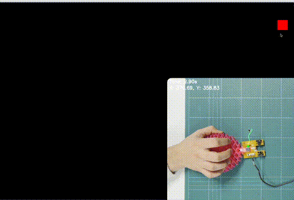
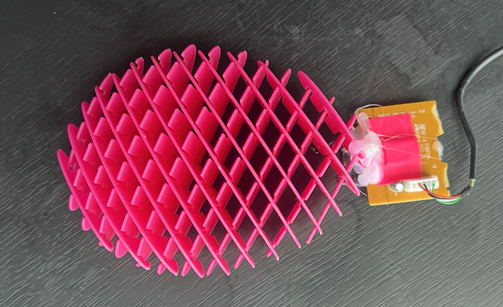

# Fleximouse ergodesign
Watch the video here: [Youtube](https://youtube.com/playlist?list=PL8Ob471RcQSDtlxx66lxihxfww_0dLFrz&si=DlGAZF54hJgAhNmD)





## 📦 Overview

This project demonstrates a modified iso 9241-9 test to cover corners. The times are recorded in a csv file. Edit target sizes in the index file.

- [preprint](http://dx.doi.org/10.13140/RG.2.2.15783.25762) 
- [STL files body](https://www.crealitycloud.com/model-detail/6644218123c97821105231e2)


The demo above shows the app in action. You can try it yourself by following the setup steps below.

---

## 🚀 Getting Started
### 🖥️ Software to test Fitts law with a mod of iso 9241-9 test 

### Requirements
- [Node.js](https://nodejs.org/) (v14+ recommended)

### Installation & Running

```bash
git clone https://github.com/orioli/Modified-ISO-9241-9-
cd 
node server.js
```

## Blurb
Since its first public appearance in 1968, the computer mouse has fundamentally maintained its original three-button rigid form factor [1]. The mouse is being used "almost three times as much as the keyboard" [2]. Unfortunately,  this intensive use is associated with musculoskeletal disorders [3] that extend beyond the wrist and can affect even the users neck. 20% of computer users experience at least a chronic disorder related to computer use (with factors being mouse, keyboard, sitting posture among others. Roughly 50% have had at least one complaint in the last 12 months [4]. Many ergonomic mice exits and, in the US many companies provide them to their employees. However, these seldom are 100% effective. Why is it so hard to make an effective ergonomic mouse? And, if there are glove sizes, why aren’t there mice sizes? Another curious fact about ergonomic mice is that they are all rigid  but do they need to? If the hand is not rigid should the mouse be? This question is more relevant now than ever before because advances in 3D printing, the popularity of the soft robotics and other trends such as flexible electronics mean that it is feasible to build electronic consumer devices that are complaint to our bodies and not the other way around. Indeed! The idea to customize and personalize the computer mouse like we personalize our clothing items seems closer to reality, yet no shop stocks computer mice sizes. On the other hand, many computer users and hobbyists regularly post ergonomic photos of their mods of keyboards and mice on Reddit channels. Competitions such as the Bambulab Mouse competition have shown that the maker community is also incredibly creative when given a working framework and a standard electronic kit. Here we showcase another direction that we feel is unexplored in mice ergonomic and in mice design: compliance and flexibility. 

### DISCLOSURE
A provisional patent application related to this work has been filed (U.S. Provisional Application No. 63/768,137, filed March 6, 2025, Patent Pending) with help of KTH Innovation’s Patrik Lundmark and Thorun Grenmark. We gratefully acknowledge Jörg Conrad, Neuromorphic Lab (KTH. Linda Kan (KTH) offered long-term user feedback. 

### REFERENCES 

- [1]	D. C. Engelbart and W. K. English, “A research center for augmenting human intellect,” in Proceedings of the December 9-11, 1968, fall joint computer conference, part I on - AFIPS ’68 (Fall, part I), San Francisco, California: ACM Press, 1968, p. 395. doi: 10.1145/1476589.1476645.

- [2]	D. Odell and P. Johnson, “Evaluation of flat, angled, and vertical computer mice and their effects on wrist posture, pointing performance, and preference,” WOR, vol. 52, no. 2, pp. 245–253, Sep. 2015, doi: 10.3233/WOR-152167.

- [3]	B. Demissie, E. T. Bayih, and A. A. Demmelash, “A systematic review of work-related musculoskeletal disorders and risk factors among computer users,” Heliyon, vol. 10, no. 3, p. e25075, Feb. 2024, doi: 10.1016/j.heliyon.2024.e25075.
- [4]	B. Basakci Calik, Y. Nesrin, O. Mucahit, and C. Derya, “Effects of risk factors related to computer use on musculoskeletal pain in office workers,” International Journal of Occupational Safety and Ergonomics, vol. 28, no. 1, pp. 269–274, Jan. 2022, doi: 10.1080/10803548.2020.1765112.


